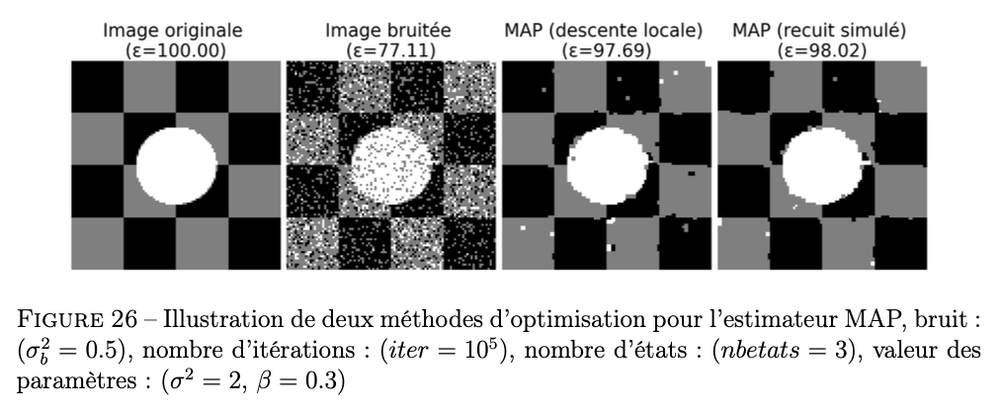

# Markov Chains application for image reconstruction

This project, in collaboration with Eva Morton and Yves Appriou, is part of my final year school project. This program applies Gaussian random noise to a given image, then uses Markov chains to reconstruct the original image. In fact, this program's goal is to minimize the overall energy of the image. This energy is calculated by choosing a random pixel in the image, reversing this pixel's value (in the black and white case), and then calculating the sum of the neighboring pixels' values. Metropolis or Gibbs sampling is applied to that sum, which gives us a two-dimensional list containing the probability of accepting the new pixel value. This program's iteration is stopped when the energy is stable or when the number of iterations is reached.

<a href="images/img.png">
